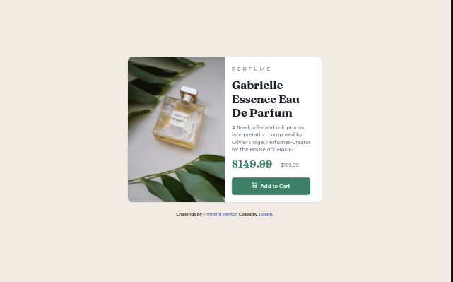

# Frontend Mentor - Product preview card component solution

This is a solution to the [Product preview card component challenge on Frontend Mentor](https://www.frontendmentor.io/challenges/product-preview-card-component-GO7UmttRfa). Frontend Mentor challenges help you improve your coding skills by building realistic projects.

## Table of contents

- [Overview](#overview)
  - [The challenge](#the-challenge)
  - [Screenshot](#screenshot)
  - [Links](#links)
  - [Built with](#built-with)
  - [What I learned](#what-i-learned)
- [Author](#author)

**Note: Delete this note and update the table of contents based on what sections you keep.**

## Overview

### The challenge

Users should be able to:

- View the optimal layout depending on their device's screen size
- See hover and focus states for interactive elements

### Screenshot



### Links

- Solution URL: [Add solution URL here](https://github.com/joeblinx39/product-preview-card-component)
- Live Site URL: [Add live site URL here](https://joeblinx39.github.io/product-preview-card-component)

### Built with

- Semantic HTML5 markup
- CSS custom properties
- Flexbox

### What I learned

I learnt how to make a card responsive as well as the image

```html
<h1>Some HTML code I'm proud of</h1>
```

```css
.proud-of-this-css {
  color: papayawhip;
}
```

## Author

- Frontend Mentor - [@joeblinx39](https://www.frontendmentor.io/profile/joeblinx39)
- Twitter - [@JosephJBassey](https://www.twitter.com/JosephJBassey)
